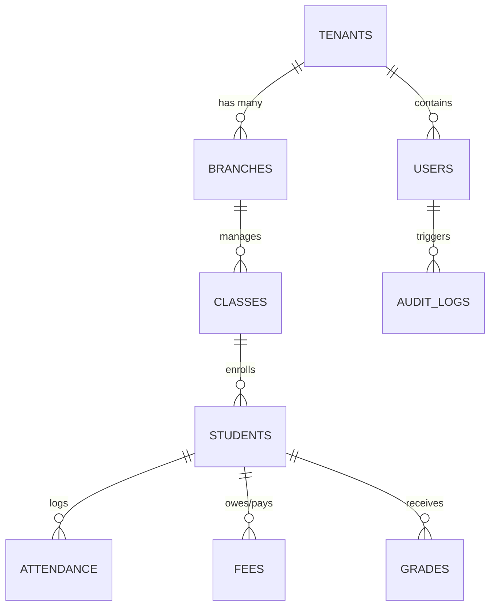

# 🏗️ SCHOOL/COLLEGE ERP SAAS — SYSTEM ARCHITECTURE DOCUMENT

**Document Version**: 2.4  
**Target Platform**: Web (React 18 + Vite + Firebase Cloud Infrastructure)

---

## 1. ARCHITECTURAL OVERVIEW

The application is engineered as a **Multi-Tenant SaaS Platform** built with client-side isolation, central authorization, dynamic CSS variable theme injection, and modular feature entitlements.

```text
┌────────────────────────────────────────────────────────────────────────────────────────┐
│                                 REACT 18 VITE FRONTEND                                 │
├────────────────────────────────────────────────────────────────────────────────────────┤
│  Zustand Auth Store   │   Theme Context Engine   │  React Query Server State Cache     │
├───────────────────────┴──────────────────────────┴─────────────────────────────────────┤
│                          ENTERPRISE SHELL & ROUTER (App.jsx)                           │
├──────────────┬──────────────┬─────────────┬─────────────┬────────────┬─────────────────┤
│  SuperAdmin  │   SubAdmin   │    Admin    │   Teacher   │  Student   │ Parent / Staff  │
├──────────────┴──────────────┴─────────────┴─────────────┴────────────┴─────────────────┤
│                                     SERVICE LAYER                                      │
│  authService │ tenantService │ academicService │ razorpayService │ pdfService │ audit  │
├────────────────────────────────────────────────────────────────────────────────────────┤
│                                FIREBASE INFRASTRUCTURE                                 │
│  Firebase Auth   │   Cloud Firestore DB   │   Firebase Storage   │  Firebase Hosting   │
└────────────────────────────────────────────────────────────────────────────────────────┘
```

---

## 2. STATE MANAGEMENT STRATEGY

1. **Zustand (`useAuthStore`)**: Manages client-side session state:
   - `user`: Firebase Auth User object.
   - `userProfile`: Extended profile (`uid`, `email`, `role`, `tenantId`, `branchId`, `name`).
   - `impersonating`: Boolean flag indicating SuperAdmin admin impersonation mode.

2. **React Context (`ThemeProvider`)**: Manages real-time theme CSS variables:
   - Injects `--color-primary`, `--color-bg-primary`, `--color-bg-surface` dynamically into `:root`.
   - Supports instant split-screen live previewing in Theme Studio.

3. **React Query (`QueryClient`)**: Handles server state fetching, caching (`staleTime: 5 mins`), pagination, and optimistic UI mutations.

---

## 3. FIRESTORE DATABASE ENTITY RELATIONS



### Collection Schema Definitions:
- `tenants/{tenantId}`: Institution name, code, domain, active plan, enabledModules map, themeConfig object.
- `tenants/{tenantId}/branches/{branchId}`: Branch name, address, admin User ID.
- `users/{uid}`: Email, name, role, tenantId, branchId, status.
- `students/{studentId}`: Personal info, rollNo, classId, sectionId, parentUid, feeStatus.
- `fees/{feeId}`: StudentId, feeHead, amount, dueDate, status, paymentTxnId.
- `auditLogs/{logId}`: Action type, actor, target, timestamp, IP.
